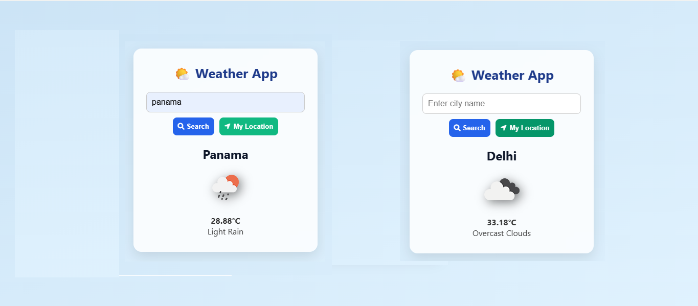

# 📍🌤️ Geolocation Weather App

This app is an updated project of the weather-app with geolocation functionality support. You can view the basic version [here](https://github.com/youknowankit/weather-app). 

  
*A clean, responsive weather application using the OpenWeather API*

## ✨ Features
- 🔍 Search weather by **city name**
- 📍 **Get weather by your current location** (Geolocation API)
- 🌡️ Temperature in Celsius
- 🌦️ Weather condition icons
- 📱 Mobile-friendly design
- 🛡️ Error handling for invalid inputs and geolocation access denial

## 🚀 What's New
- ✅ **Geolocation Support**: The app can now fetch weather based on your current location automatically if permission is granted.

## ⚙️ Local Setup

1. **Get an API Key** (Free):
   - Sign up at [OpenWeatherMap](https://openweathermap.org/)
   - Get your API key from [API Keys](https://home.openweathermap.org/api_keys)

2. **Clone and Run the App**:
   ```bash
   git clone https://github.com/youknowankit/weather-app.git
   cd weather-app
